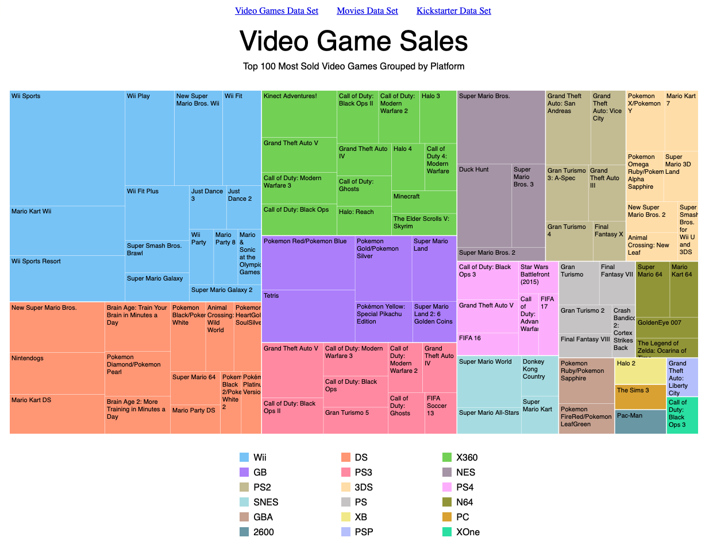

# 🚀 D3 Treemap Example

A basic treemap example in D3 using various datasets.

Built for the freeCodeCamp Data Visualization Certificate.

A live build can be found [here](https://aaronishibashi.com/portfolio/web/d3-tree-map/).

## Tools
- D3.js
- TypeScript
- Stylus
- Webpack

## Build

```
npm install
npm run build
```
